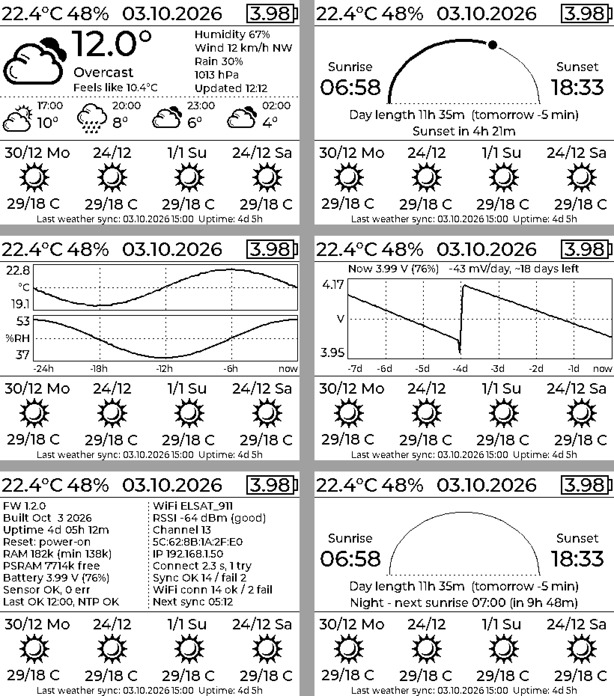

# ESP32-S3 RLCD Weather Clock

A simple desk clock built around the [Waveshare ESP32-S3-RLCD-4.2](https://www.waveshare.com/esp32-s3-rlcd-4.2.htm) — a 4.2" reflective LCD (e-paper-like) development board.

The project was written from scratch in **VS Code with ESP-IDF**, with help from AI along the way. I really don't like working in the Arduino environment, so ESP-IDF + VS Code was the natural choice here.

## Features

- Time and date on a low-power reflective display
- Indoor temperature and humidity from the onboard SHTC3 sensor (top-left corner of the screen) — being an onboard sensor, it sits close to the electronics, so readings are only approximate, not lab-grade
- 4-day weather forecast fetched over Wi-Fi (Open-Meteo), always starting from *today* (5 days are downloaded, so the row shifts correctly after midnight)
- Battery voltage / percentage indicator
- RTC-based timekeeping (PCF85063) that survives power loss
- **Extra info pages** shown in place of the big clock (top bar and forecast stay visible):
  - **Outdoor now** — temperature, conditions, feels-like, humidity, wind (speed + direction), chance of rain, pressure, plus a +3 h / +6 h / +9 h / +12 h outlook
  - **Sunrise / sunset** — times, day length (and how it changes tomorrow), sun position on an arc, time to sunset / next sunrise
  - **Indoor history** — temperature and humidity chart for the last 24 h (10-minute averages)
  - **Battery history** — voltage chart for the last 7 days (hourly averages) with a discharge trend and an estimate of the remaining days
  - **Diagnostics** — firmware version and build date, uptime, reset reason, free RAM / PSRAM, sensor status, Wi-Fi SSID / RSSI / channel / BSSID / IP, connection time and attempts, sync statistics, last error and the next scheduled sync
- Visible **"Syncing..."** indicator during every update (top bar date + progress in the bottom line)
- Sync failures are shown on screen with the reason (e.g. `no AP found`, `handshake (pass?)`) and the next retry time

## Screens

*From top-left: outdoor now, sunrise / sunset, indoor 24 h, battery 7 days, diagnostics, sunrise / sunset at night.*

## Setup

Before flashing, edit the config headers with your own details:

- `firmware/components/clock/clock_config.h` — your Wi-Fi SSID and password
- `firmware/components/clock/weather_config.h` — your location (latitude / longitude) for the weather forecast
- `firmware/main/user_config.h` — pins and `APP_FW_VERSION` (shown on the diagnostics page)

Optional: the Wi-Fi country code defaults to `PL` (so the radio also scans channels 12–13). To change it, add `#define CLOCK_WIFI_COUNTRY "DE"` (or your country) to `clock_config.h`.

## Controls

| Button | Action |
|---|---|
| Left (KEY) | Short press: force an immediate weather + time update · Hold 3 s: diagnostics page |
| Middle | Long press: power off · Short press: power back on |
| Right (BOOT) | Cycle info pages: clock → outdoor now → sunrise / sunset → indoor 24 h → battery 7 days → clock |

Info pages return to the clock automatically after **10 s** (diagnostics after 30 s). Every press restarts the timeout.

## How it works

The clock spends most of its time in **light sleep** to save power. It wakes up once a minute to refresh the time from the internal RTC, read the sensors and store history — or immediately when a button is pressed.

Twice a day, at **05:00** and **15:00**, it connects to Wi-Fi to sync the RTC with NTP and fetch the weather (daily forecast, 48 h hourly forecast and sunrise / sunset in a single Open-Meteo request). Because the device only goes online twice a day, the *Outdoor now* page uses the hourly forecast for the current hour rather than a measurement that may be hours old.

### Reliable syncing

- A sync is considered due whenever the last successful one is older than the most recent 05:00 / 15:00 slot, so a missed slot is never skipped.
- If a sync fails, it is retried after 10, 20, 40 and then every 60 minutes until it succeeds.
- Each connection keeps retrying for up to 30 s (fast reconnect using the cached channel / BSSID first, then a full scan picking the strongest AP).
- If there is no Wi-Fi at power-up (e.g. the router boots slower after a power outage), the clock keeps running on RTC time and retries in the background instead of halting.
- Wi-Fi configuration is kept in RAM, so syncing does not wear the flash.

### History storage

Indoor (24 h) and battery (7 days) history is kept in RTC memory. It survives resets, crashes and sleep, but is cleared when the board loses power completely.

### GUI

The main screens are designed in **EEZ Studio** (LVGL 9). The info pages are written directly in C and drawn on top of the clock area, so the EEZ project does not need any changes. Only one page exists in memory at a time to stay within the 64 kB LVGL heap.

## ⚠️ Battery life

This module is **not particularly battery-friendly**. With the screen on, it draws around **8 mA even in light sleep**, which works out to roughly **14 days** of runtime on a single charge. Keep that in mind if you're planning to run it purely on battery. The battery history page shows the actual discharge trend and an estimate of the remaining days.

## Hardware

- [Waveshare ESP32-S3-RLCD-4.2](https://www.waveshare.com/esp32-s3-rlcd-4.2.htm)

## 3D-printed case

The snap-on cover shown in the photo is available on MakerWorld: [Snap-on cover for Waveshare ESP32-S3-RLCD-4.2](https://makerworld.com/pl/models/3069911-snap-on-cover-for-waveshare-esp32-s3-rlcd-4-2#profileId-3455833)
